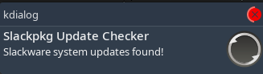

## Build

The best way to build  from source (latest version) is  [SlackBuilds.org](https://slackbuilds.org/repository/15.0/system/slackpkg-update-notify/)

If for some reason you want to build master branch:

1. `git clone https://github.com/rizitis/slackpkg-update-notify.git`
2. `cd slackpkg-update-notify/SlackBuild || exit 1 `
3. `su -c "bash slackpkg-update-notify.SlackBuild"`
4. `su -c "upgradepkg --install-new --reinstall /tmp/slackpkg-update-notify-1.0-noarch-1_custom.txz"`

### After installation finish as root:
> paste these lines in /etc/rc.d/rc.local
```
# Slackpkg update notify
if [ -x /usr/bin/slk-changelog-check ]; then
logger -t rc.local "starting slk-changelog-check"
echo "starting slk-changelog-check"
sleep 120 && /usr/bin/slk-changelog-check &
fi
```

create if not exist a /etc/rc.d/rc.local_shutdown
copy paste in:
```
#!/bin/bash
#
# Remove slk-notify lock file from /tmp
if [ -f /tmp/slk-notify.lock ]; then
    rm -f /tmp/slk-notify.lock
fi
```
chmod +x /etc/rc.d/rc.local_shutdown

### Optional: run every 6 hours via cron

By default `slk-changelog-check` runs once at boot from `rc.local`.  
If you want it to also check every 6 hours, add a cron job as root:

```
su -
crontab -e
```

Add this line:

```
0 */6 * * * /usr/bin/slk-changelog-check
```

Save and exit. Verify it was added:

```
crontab -l
```

You can watch behavior from `/var/log/messages` something like this:

```
cat /var/log/messages | grep slk
```

```
May 2 16:56:24 hackbox rc.local: starting slk-changelog-check
May 2 16:58:24 hackbox slk-changelog-check: Fetched 3 lines from ChangeLog.
May 2 16:58:24 hackbox slk-changelog-check: No changes detected.
```

---

## Binary 

A  noarch  slackware package ready for installation might exist on [Releases](https://github.com/rizitis/slackpkg-update-notify/releases)
<br>
if so, you can download and use it for installation
```
# upgradepkg --install-new --reinstall slackpkg-update-notify-*-noarch-1_custom.txz
 ``` 
But  build and install from source  is always preferred
